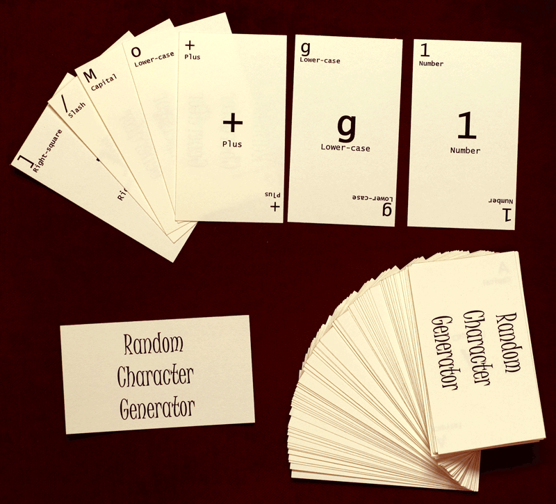

analogCardRandomizer
====================

Cards are much slower than PRNGs, but a deck can be shuffled in such a way that no-one can predict the order.  This project prints a deck of 95 characters, numbers, and symbols on business cards that you can then shuffle to generate truly random passwords of arbitrary strength.  The file that prints out the cards was done on Windows years ago (before I switched to Linux) and it was going to be difficult to convert it to OpenOffice.  If someone wants to, I'd love to incorporate that into this project. 

Full-color description available on my blog:
http://glenpeterson.blogspot.com/2012/12/analog-random-character-generator.html

License
=======
Everything in this project is Copyright 2007 Glen K. Peterson and licensed under the Creative Commons Attribution-NonCommercial-ShareAlike 3.0 Unported License. To view a copy of this license, visit http://creativecommons.org/licenses/by-nc-sa/3.0/

Files
=====
cardsMsWord.doc - A Microsoft Word document that will print the cards (2-sided) onto 10 sheets of standard business card stock (Avery #5877).

permutationAnalysis.png - A picture of the formula for showing on the web.

permutationAnalysis2.png - Permutation notation of the same

randCharGenBig.jpg - A picture of a completed deck of cards

randCharGenTiny.gif - A smaller version of the same.

randIntroMsWord.doc - A Microsoft Word document which explains the reasoning behind the cards and how to use them securely

randIntroOpenOff.odt - Open-Office version of the same.
